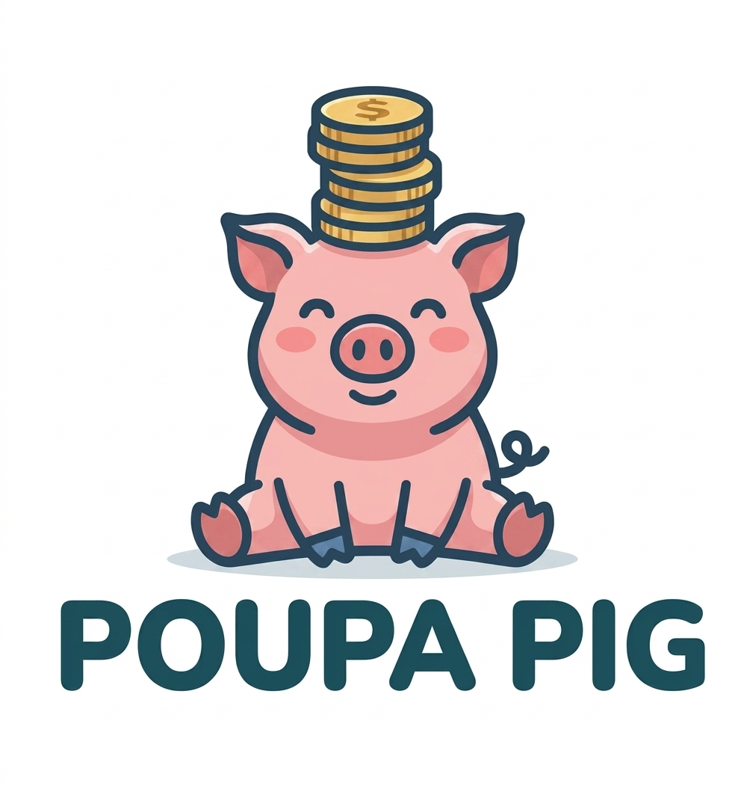

# 🐷 Poupa Pig



## Sobre o projeto

O Poupa Pig é um sistema web responsivo que ajuda o usuário a registrar decisões de compra, aplicar um período de "quarentena" antes de decidir, e visualizar o impacto financeiro dessas decisões ao longo do tempo.

## Problema que resolve

Muitas pessoas fazem compras por impulso, especialmente online, sem dar tempo pra avaliar se realmente precisam do item. Esse padrão de consumo gera gasto desnecessário e arrependimento posterior, mas falta uma ferramenta simples que force uma pausa entre "ver o produto" e "comprar o produto". Diferente de apps de finanças tradicionais (que registram gastos já feitos), o Poupa Pig intervém *antes* da compra acontecer.

## Público-alvo

Pessoas que querem controlar melhor o próprio consumo por impulso — sem perfil técnico específico. Sistema pensado para uso pessoal via navegador (desktop ou celular).

## Funcionalidades previstas

- Cadastro e login de usuário (autenticação via banco, senha com hash)
- CRUD de itens de compra (nome, preço, link/imagem, categoria, prioridade, prazo de quarentena)
- CRUD de categorias customizáveis por usuário
- Regras de decisão: comprei / desisti / ainda pensando (com extensão de prazo)
- Reforço automático do motivo original ao vencer o prazo de quarentena
- Dashboard com economia total, ranking de categorias e evolução (semanal ou mensal)
- Simulador de "e se tivesse comprado tudo"
- Busca de preço de referência via API do Mercado Livre
- Front-end responsivo
- Exportação de histórico em PDF/CSV

## Tecnologias

- HTML5
- CSS3
- Bootstrap
- PHP
- MySQL
- phpMyAdmin
- Git / GitHub
- Figma
- Trello

## Documentação do projeto
- [Project Exchange] (docs/PROJECT_EXCHANGE.md)

## Estrutura do projeto

```
poupa-pig/
├── frontend/
│   ├── index.php
│   ├── pages/
│   ├── components/
│   ├── css/styles.css
│   ├── js/main.js
│   └── assets/{images,icons,logos}/
├── backend/
│   ├── config/
│   ├── controllers/
│   ├── models/
│   └── services/
├── database/
│   ├── migrations/
│   ├── seeds/
│   └── database.sql
├── docs/
├── .github/
│   ├── ISSUE_TEMPLATE/
│   └── pull_request_template.md
├── .gitignore
└── README.md
```

## Como executar

1. Clone o repositório: `git clone https://github.com/senac-pis/poupa-pig`
2. Copie a pasta do projeto para `htdocs/` do XAMPP
3. Inicie o Apache e o MySQL pelo painel do XAMPP
4. Importe o arquivo `database/database.sql` pelo phpMyAdmin
5. Acesse `http://localhost/poupa-pig` no navegador

## Equipe

| Integrante | Responsabilidade |
|---|---|
| Kaio | Gerenciamento do projeto |
| Levi | Back-end |
| Gabriel | Front-end |
| Lucas | Banco de dados |

## Links

- Figma: [Poupa Pig](https://www.figma.com/design/m9gI8kevph97sNSiFql9Ki/poupa-pig?node-id=0-1&t=AKTjgEf1Ks2EAlQu-1)
- Trello: [Poupa Pig](https://trello.com/invite/b/6a8a682f172e2057c6c1dd4c/ATTIe238042ab16ef4737719ffb31929012388465147/poupa-pig)
- Repositório: [senac-pis/poupa-pig](https://github.com/senac-pis/poupa-pig)